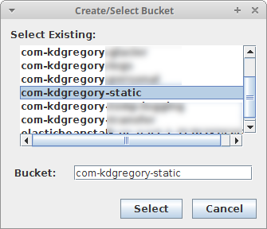
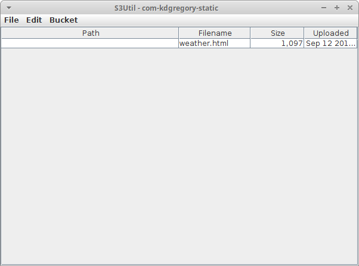

This is a simple file manager for AWS S3: it shows you the files in a bucket and
lets you upload, download, and delete them.

However, its real reason for existing is to serve as example code for Swing
programming techniques, in particular for [this article on asynchonous
programming](https://www.kdgregory.com/index.php?page=swing.async).

To build (using [Maven](http://maven.apache.org/)):

```
mvn clean package
```

To run:

```
java -jar target/s3util-*.jar 
```

You must have AWS credentials configured, using one of the mechanisms described
[here](https://docs.aws.amazon.com/sdk-for-java/v1/developer-guide/credentials.html#credentials-default).o

The first time you start the program you'll be presented with the bucket selection
dialog:



Once you select a bucket the program will read the contents of that bucket and
display it in the main screen:



You can change the selected bucket using the "Bucket" menu; your selected bucket
will be remembered the next time you start the program. The "File" menu gives you
options to upload, download, and delete files.

Since this program is intended as a teaching aid, all actions are logged to the
console, showing the thread that they execute on.
